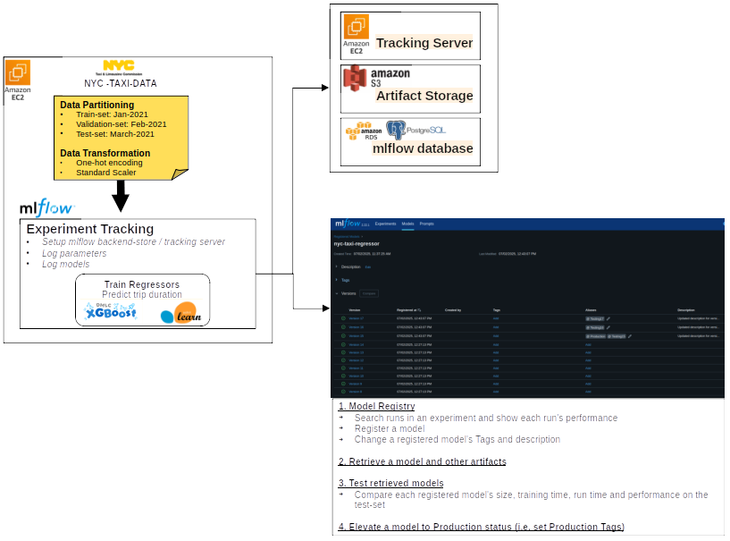

# MLOps

## 📚 Index

1. [Setup EC2 Development Environment](#01-setup-development-environment)<br>
2. [Experiment Tracking](#02-experiment-tracking)<br>

## 1. Setup EC2 Development Environment
- Create EC2 Instance
- Setup ssh access to EC2 instance
- Install [uv-python ](https://docs.astral.sh/uv/getting-started/installation/) to EC2 instance:
```bash
curl -LsSf https://astral.sh/uv/install.sh | sh
```
- Install needed packages
```bash
uv add mlflow numpy pandas xgboost scikit-learn jupyter lab
```
- Activate venv
source .venv/bin/activate

- Start MLflow
```bash
cd /mlflow/diretcory/
mlflow ui --backend-store-uri sqlite:///mlflow/mlflow.db
```
- Monitor CPU
```bash
sar -u 5
```


## 2. Experiment Tracking

