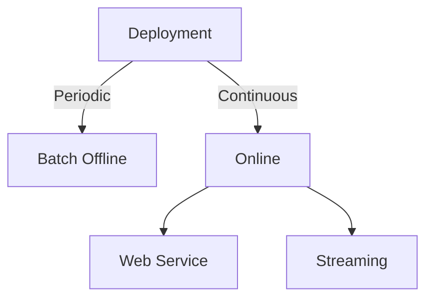

# MLOps Learning Project

This repository contains an MLOps learning project showcasing the essential components of machine learning deployment and management in production environments.

## 📚 Table of Contents

1. [Setup EC2 Development Environment](/week01/)
2. [Experiment Tracking](/week02/)
3. [Orchestration](/week03/)
4. [Deployment](/week04/)

## [1. Setup EC2 Development Environment](/week01/) <a name="01-setup-development-environment"></a>

This section covers setting up a cloud-based development environment for MLOps practices.

### Key Steps:
- Create EC2 Instance
- Setup SSH access to EC2 instance
- Install [uv-python](https://docs.astral.sh/uv/getting-started/installation/) to EC2 instance:
```bash
curl -LsSf https://astral.sh/uv/install.sh | sh
```
- Install required packages:
```bash
uv add mlflow numpy pandas xgboost scikit-learn jupyter lab
```
- Activate virtual environment:
```bash
source .venv/bin/activate
```
- Start MLflow:
```bash
cd /mlflow/directory/
mlflow ui --backend-store-uri sqlite:///mlflow/mlflow.db
```
- Monitor CPU usage:
```bash
sar -u 5
```

## [2. Experiment Tracking](/week02/) <a name="02-experiment-tracking"></a>

Learn how to track and manage machine learning experiments using MLflow and other tools.


### Key Topics:
- MLflow setup and configuration
- Experiment logging and tracking
- Model versioning and registry
- Comparing experiment results

## [3. Orchestrating ML Pipelines](/week03/) <a name="03-orchestration"></a>

Explore workflow orchestration and pipeline management for machine learning projects.

### Key Topics:
- Pipeline design and architecture
- Workflow orchestration tools (Airflow, Prefect, etc.)
- Data pipeline automation
- Monitoring and error handling

## [4. Deploying ML Models](/week04/) <a name="04-deployment"></a>

Learn various deployment strategies and patterns for machine learning models in production.



### Key Topics:
- Batch vs. online processing
- Web service deployment
- Streaming architectures
- Deployment strategies (Blue/Green, Canary, etc.)
- Monitoring and maintenance

## 🚀 Getting Started

### Prerequisites
- AWS Account with EC2 access
- Basic understanding of Python and machine learning
- Familiarity with command line tools

### Quick Setup
1. Clone this repository
2. Follow the setup instructions in [Week 1](/week01/)
3. Work through each week sequentially

## 📁 Project Structure

```
mlops-dlp/
├── week01/              # Development environment setup
├── week02/              # Experiment tracking with MLflow
├── week03/              # ML pipeline orchestration
├── week04/              # Model deployment strategies
├── Visual_Summaries/    # Visual learning aids
├── mlflow/              # MLflow artifacts and database
└── README.md           # This file
```

## 🛠️ Technologies Used

- **Python**: Primary programming language
- **MLflow**: Experiment tracking and model management
- **XGBoost**: Machine learning framework
- **Scikit-learn**: ML utilities and algorithms
- **Jupyter**: Interactive development environment
- **AWS EC2**: Cloud computing platform
- **uv**: Fast Python package manager

## 📚 Learning Outcomes

By completing this project, you will learn:
- How to set up a cloud-based ML development environment
- Best practices for experiment tracking and model versioning
- Pipeline orchestration techniques for ML workflows
- Various deployment patterns for ML models in production
- Monitoring and maintenance of ML systems

## 🤝 Contributing

Feel free to submit issues, fork the repository, and create pull requests for any improvements.

## 📄 License

This project is for educational purposes. Please refer to individual tool licenses for usage terms.