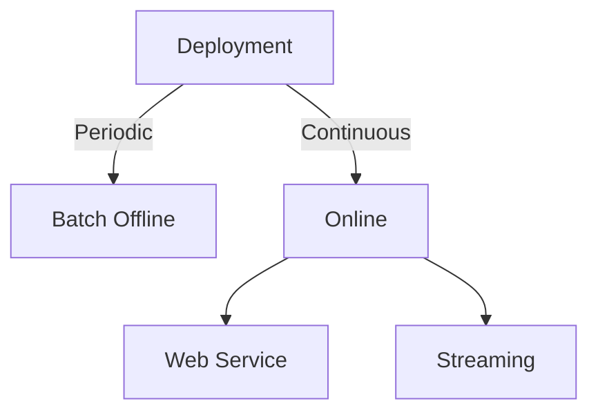

# MLOps Learning Project

This repository contains an MLOps learning project showcasing the essential components of machine learning deployment and management in production environments.

## 📚 Table of Contents

1. [Setup EC2 Development Environment](/w1_Setup_Cloud_Environment/)
2. [Experiment Tracking](/w2_Experiment_Tracking/)
3. [Orchestration](/w3_Orchestration/)
4. [Deployment](/w4_Deployment/)

## [1. Setup EC2 Development Environment](/w1_Setup_Cloud_Environment/) <a name="01-setup-development-environment"></a>

This section covers setting up a cloud-based development environment for MLOps practices.

### Key Steps:
- Create EC2 Instance
- Setup SSH access to EC2 instance
- Install [uv-python](https://docs.astral.sh/uv/getting-started/installation/) to EC2 instance:
```bash
curl -LsSf https://astral.sh/uv/install.sh | sh
```
- Install required packages:
```bash
uv add mlflow numpy pandas xgboost scikit-learn jupyter lab
```
- Activate virtual environment:
```bash
source .venv/bin/activate
```
- Start MLflow:
```bash
cd /mlflow/directory/
mlflow ui --backend-store-uri sqlite:///mlflow/mlflow.db
```
- Monitor CPU usage:
```bash
sar -u 5
```

## [2. Experiment Tracking](/w2_Experiment_Tracking/) <a name="02-experiment-tracking"></a>

This section covers how to track and manage machine learning experiments using MLflow and other tools.


### Key Topics:
- MLflow setup and configuration
- Experiment logging and tracking
- Model versioning and registry
- Comparing experiment results

## [3. Orchestrating ML Pipelines](/w3_Orchestration/) <a name="03-orchestration"></a>

This section explores workflow orchestration and pipeline management for machine learning projects.

### Key Topics:
- Pipeline design and architecture
- Workflow orchestration tools (Airflow, Prefect, etc.)
- Data pipeline automation
- Monitoring and error handling

## [4. Deploying ML Models](/w4_Deployment/) <a name="04-deployment"></a>

This section covers deployment strategies for machine learning models in production.




### Key Topics:
- Batch vs. online processing
- Web service deployment
- Streaming architectures
- Deployment strategies (Blue/Green, Canary, etc.)
- Monitoring and maintenance

## 📁 Project Structure

```
mlops-dlp/
├── w1_Setup_Cloud_Environment/     # Development environment setup
├── w2_Experiment_Tracking/         # Experiment tracking with MLflow
├── w3_Orchestration/               # ML pipeline orchestration
├── w4_Deployment/                  # Model deployment strategies
├── Visual_Summaries/               # Visual learning aids
├── mlflow/                         # MLflow artifacts and database
└── README.md                       # This file
```

## 🛠️ Technologies Used

- **Python**: Primary programming language
- **MLflow**: Experiment tracking and model management
- **XGBoost**: Machine learning framework
- **Scikit-learn**: ML utilities and algorithms
- **Jupyter**: Interactive development environment
- **AWS EC2**: Cloud computing platform
- **uv**: Fast Python package manager
