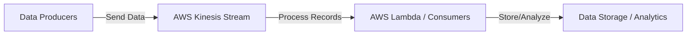

# Deployment of Streaming Data Processing
This example uses AWS Kinesis and AWS Lambda to process streaming data.

## - AWS Kinesis is an event stream processing service (similar to Kafka) that can continuously ingest and process large streams of data records in real-time.


## - AWS Lambda is a serverless compute service that runs code in response to events and automatically manages the compute resources required by that code.
```mermaid
flowchart LR
    E[Event Source] -->|Trigger| F[AWS Lambda Function]
    F -->|Process| G[Output (e.g., Database, Notification, API)]
```


