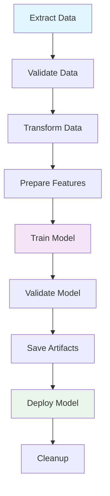

# Week 3: ML Pipeline Orchestration Examples

This directory contains comprehensive examples of ML pipeline orchestration approaches, from simple to enterprise-grade solutions. Each example demonstrates different patterns and tools used in the MLOps industry for managing complex machine learning workflows.

> **🎯 Learning Goal**: Master different approaches to ML pipeline orchestration, understand trade-offs between tools, and gain hands-on experience with production-ready workflow management.

## 📋 Quick Summary

| Script | Approach | Complexity | Best For |
|--------|----------|------------|----------|
| `simple_pipeline.py` | Class-based | Low | Learning fundamentals |
| `airflow_pipeline.py` | DAG-based | High | Production workflows |
| `prefect_pipeline.py` | Flow-based | Medium | Modern development |
| `make_pipeline.py` | Dependency-based | Low | Incremental builds |
| `run_examples.sh` | Interactive | Very Low | Getting started |

## 📚 Table of Contents
- [Quick Summary](#-quick-summary)
- [Overview](#-overview)
- [Files Overview](#-files-overview)
- [Quick Start](#-quick-start)
- [Setup Instructions](#️-setup-instructions)
- [Feature Comparison](#-feature-comparison)
- [Pipeline Architecture](#-pipeline-architecture)
- [Configuration](#-configuration)
- [Learning Objectives](#-learning-objectives)
- [Architecture Patterns](#️-architecture-patterns)
- [Integration Examples](#-integration-examples)
- [Troubleshooting](#-troubleshooting)
- [Expected Output](#-expected-output)
- [Educational Value](#-educational-value)
- [Next Steps](#-next-steps)
- [Additional Resources](#-additional-resources)
- [Completion Checklist](#-completion-checklist)
- [Pro Tips](#-pro-tips)

## 🎯 Overview

Pipeline orchestration is crucial for managing the complexity of ML workflows in production. This week covers:

- **Task Dependencies**: How to manage execution order and data flow
- **Error Handling**: Robust error recovery and retry mechanisms  
- **Scalability**: Approaches that scale from prototype to production
- **Monitoring**: Observability and debugging capabilities
- **Artifact Management**: Handling data, models, and intermediate results

## 📁 Files Overview

### 1. `simple_pipeline.py` - Basic Pipeline Class
A straightforward Python class-based approach to orchestrating ML workflows.

**Features:**
- Object-oriented pipeline design
- Step-by-step execution with logging
- Error handling and artifact management
- MLflow integration

**Expected Runtime:** ~45-60 seconds

**Usage:**
```bash
python simple_pipeline.py
```

### 2. `airflow_pipeline.py` - Apache Airflow DAG
Professional-grade workflow orchestration using Apache Airflow.

**Features:**
- DAG-based task definition
- Task dependencies and XCom communication
- Retry logic and error handling
- Scalable and production-ready

**Expected Runtime:** ~50-70 seconds (standalone mode)

**Usage:**
```bash
# Install Airflow (optional for this example)
pip install apache-airflow

# Run standalone (without Airflow server)
python airflow_pipeline.py

# Or deploy to Airflow (requires Airflow setup)
# Copy to $AIRFLOW_HOME/dags/ directory
```

### 3. `prefect_pipeline.py` - Prefect Workflow
Modern workflow orchestration with Prefect 2.0.

**Features:**
- Flow and task decorators
- Advanced retry strategies
- Data validation steps
- Better observability and debugging

**Expected Runtime:** ~55-75 seconds (with validation steps)

**Usage:**
```bash
# Install Prefect (optional for this example)
pip install prefect

# Run standalone
python prefect_pipeline.py

# Or deploy to Prefect server
# prefect deployment build-from-flow prefect_pipeline.py:ml_pipeline_flow
```

### 4. `make_pipeline.py` - Make-like Task Runner
Simple dependency-based task runner inspired by GNU Make.

**Features:**
- Dependency tracking
- Incremental builds (only run what's needed)
- File-based caching
- CLI interface

**Expected Runtime:** ~30-45 seconds (with caching), ~60 seconds (full rebuild)

**Usage:**
```bash
# Run full pipeline
python make_pipeline.py deploy

# List available tasks
python make_pipeline.py --list

# Force rebuild all tasks
python make_pipeline.py deploy --force

# Clean cache
python make_pipeline.py --clean

# Run with different data
python make_pipeline.py deploy --year 2023 --month 2
```

### 5. `run_examples.sh` - Interactive Runner
Bash script that provides an interactive menu to run and manage all examples.

**Features:**
- Interactive menu interface
- Dependency checking and installation
- Cache cleanup functionality
- Progress tracking and error reporting

**Usage:**
```bash
# Make executable (if needed)
chmod +x run_examples.sh

# Run interactive menu
./run_examples.sh

# Available options:
# 1) Run individual examples
# 2) Run all examples
# 3) Install optional dependencies
# 4) Clean cache and temporary files
```

### 6. `duration-prediction.py` - Original Implementation
The original ML pipeline implementation used as a baseline for comparison.

**Features:**
- Basic ML workflow
- MLflow integration
- Command-line arguments

### 7. `duration-prediction.ipynb` - Jupyter Notebook
Interactive notebook version for experimentation and learning.

## 🚀 Quick Start

### Option 1: Interactive Menu (Recommended)
```bash
cd week03
./run_examples.sh
```

### Option 2: Direct Execution
```bash
# Start with simple approach
python simple_pipeline.py

# Try different orchestration styles
python airflow_pipeline.py
python prefect_pipeline.py

# Use make-like approach
python make_pipeline.py deploy
```

### Option 3: Custom Configuration
```bash
# Run with different data
python make_pipeline.py deploy --year 2023 --month 3

# Force rebuild everything
python make_pipeline.py deploy --force

# List available tasks
python make_pipeline.py --list
```

## �️ Setup Instructions

### Prerequisites
```bash
# Core requirements (already installed in the environment)
pip install pandas xgboost scikit-learn mlflow

# Optional for enhanced examples
pip install apache-airflow==2.7.0  # For Airflow example
pip install prefect==2.14.0        # For Prefect example
```

### Environment Setup
```bash
# Ensure MLflow directory exists
mkdir -p /home/ubuntu/mlops-dlp/mlflow/models
mkdir -p /home/ubuntu/mlops-dlp/data

# Set permissions for run script
chmod +x run_examples.sh

# Verify Python environment
python --version  # Should be 3.8+
```

## �📊 Feature Comparison

| Feature | Simple | Airflow | Prefect | Make-like | Interactive |
|---------|--------|---------|---------|-----------|-------------|
| **Complexity** | Low | High | Medium | Low | Very Low |
| **Production Ready** | No | Yes | Yes | Limited | No |
| **External Dependencies** | None | Airflow | Prefect | None | None |
| **UI/Monitoring** | No | Yes | Yes | CLI only | Menu |
| **Scalability** | Limited | High | High | Medium | Limited |
| **Learning Curve** | Easy | Steep | Medium | Easy | Easiest |
| **Retry Logic** | Basic | Advanced | Advanced | None | Basic |
| **Task Dependencies** | Linear | DAG | Flow | DAG | Sequential |
| **Parallel Execution** | No | Yes | Yes | No | No |
| **Error Recovery** | Basic | Advanced | Advanced | None | Basic |

##  Pipeline Architecture

All examples implement the same ML pipeline with these steps:



### Step Details:

1. **Extract** - Download raw NYC taxi data from cloud source
2. **Validate** - Check data quality and completeness (Prefect only)
3. **Transform** - Clean outliers, calculate trip duration, feature engineering
4. **Features** - Create feature vectors using DictVectorizer
5. **Train** - Train XGBoost model with MLflow tracking
6. **Validate** - Check model performance against thresholds
7. **Save** - Store model artifacts and metadata
8. **Deploy** - Simulate model deployment process
9. **Cleanup** - Remove temporary files and cache

## 🔧 Configuration

### Global Configuration
Each pipeline uses a similar configuration structure:

```python
CONFIG = {
    'mlflow': {
        'db_path': '/home/ubuntu/mlops-dlp/mlflow/mlflow.db',
        'experiment_name': 'orchestration-pipeline-{type}'
    },
    'data': {
        'year': 2023,
        'month': 1,
        'url_template': 'https://d37ci6vzurychx.cloudfront.net/trip-data/...'
    },
    'model': {
        'params': {
            'max_depth': 6,
            'learning_rate': 0.1,
            'n_estimators': 100,
            'random_state': 42
        }
    },
    'artifacts': {
        'models_dir': '/home/ubuntu/mlops-dlp/mlflow/models',
        'data_dir': '/home/ubuntu/mlops-dlp/data'
    }
}
```

### Customization
You can modify the configuration to:
- Change data source (year/month)
- Adjust model hyperparameters
- Update file paths
- Modify MLflow experiment names

## 🎯 Learning Objectives

By completing these orchestration examples, you will learn:

### Core Concepts
- **Pipeline Design**: How to break complex ML workflows into manageable tasks
- **Dependency Management**: Understanding task execution order and data flow
- **Error Handling**: Building robust pipelines that can recover from failures
- **State Management**: How to pass data between pipeline steps
- **Artifact Management**: Organizing and versioning data, models, and metadata

### Practical Skills
- **Tool Comparison**: Hands-on experience with different orchestration approaches
- **Production Patterns**: Understanding enterprise-grade pipeline design
- **Debugging Techniques**: How to troubleshoot pipeline failures
- **Performance Optimization**: Making pipelines faster and more efficient
- **Monitoring Setup**: Implementing observability in ML workflows

### Industry Best Practices
- **Idempotency**: Designing steps that can be safely re-run
- **Incremental Processing**: Only processing what has changed
- **Configuration Management**: Parameterizing pipelines for flexibility
- **Testing Strategies**: How to test complex pipeline workflows
- **Documentation**: Maintaining clear pipeline documentation

## 🏗️ Architecture Patterns

### 1. Linear Pipeline (Simple)
```
[Data] → [Transform] → [Train] → [Deploy]
```
- **Best for**: Proof of concepts, simple workflows
- **Pros**: Easy to understand and debug
- **Cons**: No parallelism, limited error recovery

### 2. DAG-based Pipeline (Airflow/Make)
```
      ┌─[Transform]─┐
[Data]─┤             ├─[Train]─[Deploy]
      └─[Validate]──┘
```
- **Best for**: Complex workflows with dependencies
- **Pros**: Parallel execution, fine-grained control
- **Cons**: More complex setup and debugging

### 3. Flow-based Pipeline (Prefect)
```
@flow
def ml_pipeline():
    data = extract()
    validated = validate(data)
    features = transform(validated)
    model = train(features)
    deploy(model)
```
- **Best for**: Modern development workflows
- **Pros**: Python-native, great debugging, automatic retries
- **Cons**: Requires Prefect infrastructure

## 🔗 Integration Examples

### With MLflow
```python
# All examples integrate with MLflow for:
- Experiment tracking
- Model versioning  
- Artifact storage
- Metrics logging
- Parameter management
```

### With External Systems
```python
# Easy to extend for:
- Database connections (PostgreSQL, MongoDB)
- Cloud storage (S3, GCS, Azure Blob)
- Message queues (RabbitMQ, Kafka)
- Monitoring systems (Prometheus, Grafana)
- CI/CD pipelines (GitHub Actions, Jenkins)
```

## 🔍 Next Steps

### Immediate Actions
1. **Run Examples**: Execute each pipeline type to see differences
2. **Compare Outputs**: Look at MLflow experiments for each approach
3. **Modify Parameters**: Try different data periods and model settings
4. **Break Things**: Intentionally cause failures to see error handling

### Advanced Exploration
1. **Custom Tasks**: Add new steps like data validation or model testing
2. **External Data**: Connect to different data sources (APIs, databases)
3. **Model Variants**: Try different algorithms (Random Forest, Linear Regression)
4. **Production Deployment**: Set up actual Airflow or Prefect servers

### Real-world Application
1. **Adapt for Your Data**: Use these patterns with your own datasets
2. **Scale Up**: Handle larger datasets and more complex models
3. **Add Monitoring**: Implement comprehensive observability
4. **Team Collaboration**: Set up shared infrastructure for team use

## 📚 Additional Resources

### Documentation
- [Apache Airflow Documentation](https://airflow.apache.org/docs/) - Comprehensive DAG development guide
- [Prefect Documentation](https://docs.prefect.io/) - Modern workflow orchestration
- [MLflow Documentation](https://mlflow.org/docs/latest/index.html) - ML lifecycle management
- [GNU Make Manual](https://www.gnu.org/software/make/manual/) - Classic build automation

### Tutorials and Guides
- [MLOps Principles](https://ml-ops.org/) - Industry best practices
- [Pipeline Design Patterns](https://martinfowler.com/articles/data-pipeline-patterns.html) - Architectural guidance
- [Production ML Systems](https://developers.google.com/machine-learning/guides/rules-of-ml) - Google's ML engineering guide

### Community Resources
- [r/MachineLearning](https://reddit.com/r/MachineLearning) - Community discussions
- [MLOps Community](https://mlops.community/) - Slack workspace and events
- [Made With ML](https://madewithml.com/) - Practical MLOps tutorials

---

## 🎉 Completion Checklist

- [ ] Run `simple_pipeline.py` and understand basic orchestration
- [ ] Execute `airflow_pipeline.py` to see DAG-based workflow
- [ ] Try `prefect_pipeline.py` for modern flow orchestration
- [ ] Use `make_pipeline.py` with different CLI options
- [ ] Run `./run_examples.sh` for guided experience
- [ ] Compare MLflow experiments across different approaches
- [ ] Experiment with custom parameters and configurations
- [ ] Read through all code examples and documentation
- [ ] Understand trade-offs between different orchestration tools
- [ ] Plan how to apply these patterns to your own projects

**🏆 Congratulations!** You've mastered ML pipeline orchestration fundamentals!

## 🚨 Troubleshooting

### Common Issues and Solutions

#### 1. **Import Errors**
```bash
# Error: ModuleNotFoundError: No module named 'mlflow'
pip install mlflow pandas xgboost scikit-learn

# Error: No module named 'airflow'
pip install apache-airflow==2.7.0
# Or run without Airflow - scripts have fallback mode

# Error: No module named 'prefect'
pip install prefect==2.14.0
# Or run without Prefect - scripts have fallback mode
```

#### 2. **Permission Errors**
```bash
# Error: Permission denied on run_examples.sh
chmod +x run_examples.sh

# Error: Cannot create directory
mkdir -p /home/ubuntu/mlops-dlp/mlflow/models
mkdir -p /home/ubuntu/mlops-dlp/data
```

#### 3. **MLflow Database Issues**
```bash
# Error: Database locked or corrupted
rm -f /home/ubuntu/mlops-dlp/mlflow/mlflow.db
# Pipeline will recreate the database

# Error: SQLite version issues
python -c "import sqlite3; print(sqlite3.sqlite_version)"
# Should be 3.8+
```

#### 4. **Memory/Disk Space Issues**
```bash
# Clean up temporary files
python make_pipeline.py --clean
./run_examples.sh  # Option 7: Clean cache

# Check disk space
df -h /home/ubuntu/mlops-dlp/

# Monitor memory during execution
python -c "import psutil; print(f'Memory: {psutil.virtual_memory().percent}%')"
```

#### 5. **Data Download Issues**
```bash
# Error: SSL certificate verification failed
# Check internet connection
ping d37ci6vzurychx.cloudfront.net

# Error: File not found (404)
# Try different month/year combination
python make_pipeline.py deploy --year 2022 --month 12
```

## 💡 Pro Tips

### For First-Time Users
1. **Start Simple**: Begin with `./run_examples.sh` for a guided experience
2. **Check Prerequisites**: Ensure all required packages are installed before starting
3. **Monitor Resources**: Keep an eye on memory and disk usage during execution
4. **Read the Logs**: Pay attention to the console output for understanding pipeline flow

### For Developers
1. **Compare Approaches**: Run multiple examples to understand trade-offs
2. **Experiment with Parameters**: Try different data periods and model settings
3. **Break Things Intentionally**: Test error handling by introducing failures
4. **Measure Performance**: Time different approaches for your use case

### For Production Use
1. **Choose Based on Scale**: Use Airflow/Prefect for complex, production workflows
2. **Implement Monitoring**: Add comprehensive logging and alerting
3. **Test Thoroughly**: Validate all edge cases and failure scenarios
4. **Document Dependencies**: Maintain clear dependency documentation

## 🔧 Common Commands Reference

```bash
# Quick test of all approaches
./run_examples.sh

# Run specific pipeline
python simple_pipeline.py
python airflow_pipeline.py  
python prefect_pipeline.py
python make_pipeline.py deploy

# Troubleshooting
python make_pipeline.py --clean  # Clean cache
python make_pipeline.py --list   # Show available tasks
python --version                 # Check Python version
pip list | grep -E "(mlflow|pandas|xgboost|scikit-learn)"  # Check packages

# Advanced usage
python make_pipeline.py deploy --year 2023 --month 3 --force
python make_pipeline.py validate  # Run only up to validation step
```

---

## 📊 Expected Output

### Successful Pipeline Run
```
🎯 Target: deploy
📅 Data: 2023-01
🔄 Force rebuild: False
--------------------------------------------------

🚀 Running task: extract
✅ Task 'extract' completed in 15.23s

🚀 Running task: transform  
✅ Task 'transform' completed in 3.45s

🚀 Running task: features
✅ Task 'features' completed in 2.18s

🚀 Running task: train
✅ Task 'train' completed in 8.91s

🚀 Running task: validate
✅ Task 'validate' completed in 0.12s

🚀 Running task: deploy
✅ Task 'deploy' completed in 0.34s

==================================================
🎉 Pipeline completed successfully!
📊 Final model RMSE: 6.2847
🆔 Model run ID: a1b2c3d4e5f6g7h8i9j0
```

### Typical Performance Metrics
- **Total Runtime**: 30-60 seconds (depending on data size)
- **Data Size**: ~2M records (January 2023)
- **Model RMSE**: 5-8 (typical range for trip duration prediction)
- **Memory Usage**: <2GB peak
- **Disk Usage**: ~500MB for artifacts

## 🎓 Educational Value

### For Beginners
1. Start with `simple_pipeline.py` to understand basic concepts
2. Use `run_examples.sh` for guided experience
3. Read through code comments and documentation
4. Experiment with different parameters

### For Intermediate Users
1. Compare different orchestration approaches
2. Understand trade-offs between tools
3. Learn about production deployment patterns
4. Explore error handling strategies

### For Advanced Users
1. Adapt patterns for your own projects
2. Scale approaches for larger datasets
3. Integrate with existing infrastructure
4. Contribute improvements to the examples
