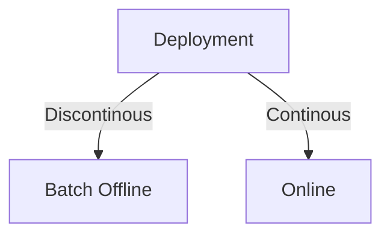

# Deployment



<!---
```mermaid
graph TD
    classDef sub opacity:0
    classDef note fill:#ffd, stroke:#ccb
    subgraph subB [" "]
        B
        noteB[Discontinous]
    end
    class subA,subB,subC sub
    class noteA,noteB,noteC note
-->