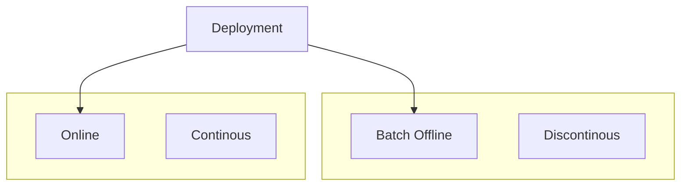

# Deployment

```mermaid
graph TD
    A[Deployment]-->B[Batch Offline];
    subgraph subB [" "]
        B
        noteB[Discontinous]
    end

    A-->C[Online];
    subgraph subC [" "]
        C
        noteC[Continous]
    end
```