# Deployment


## 1. Batch Processing
- Run the model periodically (hourly, daily, monthly)
- Usually, a ***scoring job*** performs the following steps:
    - Pull data from database
    - Run model on the data
    - Write prediction results to another database
    - Another script pulls from results database and shows dashboards 📊 📈 💰 
- Example use cases:
    - Marketing data:
        >▶️ predict users about to churn on a daily basis<br>
        >▶️ send attractive offers to avoid churn

## 2. Online Processing
### 2.1 Web Service
- This service needs to be online always
- In the case of a TaxiApp, it should be available at all times, providing the user with information like Price and Trip Duration
- The connection between the ***Backend Service*** and the ***Ride Duration Service*** is kept alive until the ***Ride Duration Service*** sends a response to the ***Backend***

```mermaid
graph LR
    classDef sub opacity:0
    classDef note fill:#ffd, stroke:#ccb

    User[👩User]--> |Request Taxi Service| Backend[Backend]
    Backend--> |"{UserID, PickUp, DropOff, ...}"| Model["Model"]
    Model--> |"Trip Duration"| Backend
    Model--> WebService[Webservice]
    Model--> Streaming[Streaming]

    subgraph subBackendService ["Backend Service "]
        Backend
    end

    subgraph subRideDurationService ["Ride Duration <br/> Prediction Service"]
        Model
    end
```


### 2.2 Streaming
- In streaming, we have one (or more) producer and several consumers
- The producer pushes events to the consumers and then this producer doesn't expect a response from the consumers.

```mermaid
graph LR
    Producer[🤖Producer]--> |Pushed Events| Consumer1[Consumer1🤖] 
    Producer[🤖Producer]--> |Pushed Events| Consumer2[Consumer2🤖]
    Producer[🤖Producer]--> |Pushed Events| Consumer3[Consumer3🤖]
    Producer[🤖Producer]--> |Pushed Events| Consumer4[Consumer4🤖]
```


#### Streaming Example

```mermaid
graph LR
    User[👩User]--> |Request Taxi Service| Backend[Backend]
    Backend--> |Trip Duration| User
    Backend--> |Pushed Events| Consumer1[Consumer1🤖] & Consumer2[Consumer2🤖] & Consumer3[Consumer3🤖]
    Backend-.- note["Events"]--> Consumer1[Consumer1🤖] & Consumer2[Consumer2🤖] & Consumer3[Consumer3🤖]

    subgraph noteB [" "]
        Backend -.- note["Initial Duration Prediction"]
    end
```


```mermaid
graph LR
    User[👩User]--> |Request Taxi Service| Backend[Backend]
    Backend--> |Trip Duration| User

    subgraph subBackend [" "]
        Backend--> RideDurationService["Initial Duration Prediction"]--> Backend
    end

    Backend--> Events[/Pushed Events/]
    Events --> Consumer1[Consumer1🤖] & Consumer2[Consumer2🤖] & Consumer3[Consumer3🤖]

    subgraph noteConsumer1 ["Dynamic Trip Duration"]
        Consumer1
    end
    subgraph noteConsumer2 ["Tip Prediction"]
        Consumer2
    end
    subgraph noteConsumer3 ["Cost Prediction"]
        Consumer3
    end

    noteConsumer1--> 'Correcetd Trip Duration' User
    noteConsumer2--> 'Tip Amount' User
    noteConsumer3--> 'Cost $' User

```

