# Deployment

## 1. Batch Processing
- Run the model periodically (hourly, daily, monthly)
- Usually, a ***scoring job*** performs the following steps:
    - Pull data from database
    - Run model on the data
    - Write prediction results to another database
    - Another script pulls from results database and shows dashboards 📊 📈 💰 
- Example use cases:
    - Marketing data:
        >▶️ predict users about to churn on a daily basis 
        >▶️ send attractive offers to avoid churn

## 2. Online Processing
### 2.1 Web Service
- This service needs to be online always
- In the case of a TaxiApp, it should be available at all times, providing the user with information like Price and Trip Duration
- The connection between the ***Backend Service*** and the ***Ride Duration Service*** is kept alive until the ***Ride Duration Service*** sends a response to the ***Backend***

```mermaid
graph LR
    classDef sub opacity:0
    classDef note fill:#ffd, stroke:#ccb

    User[👩User]--> |Request Taxi Service| Backend[Backend]
    Backend--> |"{UserID, PickUp, DropOff, ...}"| Model["Model"]
    Model--> |"Trip Duration"| Backend
    Model--> WebService[Webservice]
    Model--> Streaming[Streaming]

    subgraph subBackendService ["Backend Service "]
        Backend
    end

    subgraph subRideDurationService ["Ride Duration <br/> Prediction Service"]
        Model
    end
```

### 2.2 Streaming
- Streaming is a way to process data in real-time
- It allows us to process data as it arrives, rather than waiting for a batch of data
- In streaming, we have one (or more) producer and several consumers
- The producer pushes events to the consumers and then this producer doesn't expect a response from the consumers.

```mermaid
graph LR
    Producer[🤖Producer]--> |Pushed Events| Consumer1[Consumer1🤖] 
    Producer[🤖Producer]--> |Pushed Events| Consumer2[Consumer2🤖]
    Producer[🤖Producer]--> |Pushed Events| Consumer3[Consumer3🤖]
    Producer[🤖Producer]--> |Pushed Events| Consumer4[Consumer4🤖]
```

#### Streaming Example: TaxiApp
- In the TaxiApp, the ***Backend Service*** pushes events to the ***Dynamic Ride Duration Service***, ***Tip Prediction Service***, and ***Cost Prediction Service***:
    - The ***Dynamic Ride Duration Service*** is a streaming service that predicts the trip duration based on the initial prediction and the real-time data
    - The ***Tip Prediction Service*** predicts the tip amount based on the trip duration and other factors
    - The ***Cost Prediction Service*** predicts the cost of the trip based on the trip duration and other factors
- The ***Backend Service*** is the producer that pushes events to the consumers
- The consumers are the ***Dynamic Ride Duration Service***, ***Tip Prediction Service***, and ***Cost Prediction Service***
- The consumers send the results directly to the ***User***. The consumers could also send the results back to the ***Backend Service***, which then sends the results back to the ***User***

```mermaid
graph LR
    User[👩User]--> |Request Taxi Service| Backend[Backend]
    Backend--> |Trip Duration| User

    subgraph subBackend [" "]
        Backend--> RideDurationService["Initial Duration Prediction"]--> Backend
    end

    Backend--> Events[/Pushed Events/]
    Events --> Consumer1[Consumer1🤖] & Consumer2[Consumer2🤖] & Consumer3[Consumer3🤖]

    subgraph noteConsumer1 ["Dynamic Trip Duration"]
        Consumer1
    end
    subgraph noteConsumer2 ["Tip Prediction"]
        Consumer2
    end
    subgraph noteConsumer3 ["Cost Prediction"]
        Consumer3
    end

    noteConsumer1--> |"Corrected Trip Duration"| User
    noteConsumer2--> |"Tip Amount"| User
    noteConsumer3--> |"Cost $"| User

```

### 2.3 Differences between Web Service and Streaming ***
- In a web service, the connection between the ***Backend Service*** and the ***Dynamic Ride Duration Service*** is kept alive until the ***Dynamic Ride Duration Service*** sends a response to the ***Backend Service***
- In streaming, the ***Backend Service*** pushes events to the consumers and doesn't expect a response
- The consumers process the events and send the results back to the ***Backend Service***, which then sends the results back to the user
- The consumers can be run in parallel and in different machines, therefore they can be scaled independently

## 3. Deployment Strategies
- **Blue/Green Deployment**: Two identical environments (blue and green) are maintained.
    - One environment is live (blue) while the other (green) is idle.
    - When a new version is ready, it is deployed to the idle environment (green).
    - After testing, traffic is switched to the green environment.
- **Canary Deployment**: A new version is rolled out to a small subset of users.
    - If successful, it is gradually rolled out to more users.
- **Rolling Deployment**: The new version is gradually rolled out to all instances.
- **Shadow Deployment**: The new version runs alongside the old version, receiving real traffic but not affecting the user experience.
    - It allows for testing the new version in a production environment without affecting users.
- **A/B Testing**: Two versions (A and B) are deployed to different user segments.
    - The performance of both versions is compared to determine which one is better.

## 4. Deployment Tools
### 4.1 Model Management and Experiment Tracking
- **MLflow**: Open-source platform for managing the machine learning lifecycle, including experimentation, reproducibility, and deployment
- **Weights & Biases**: Tool for experiment tracking, dataset versioning, and model management, providing a user-friendly interface for visualizing and comparing experiments
- **Kubeflow Pipelines**: Platform for building and deploying portable, scalable machine learning workflows based on Kubernetes
- **DVC (Data Version Control)**: Open-source version control system for managing machine learning projects, allowing you to track experiments, datasets, and models
- **TensorBoard**: Visualization toolkit for TensorFlow that provides insights into model training, performance, and debugging

### 4.2 General Orchestration Tools
- **Apache Airflow**: Open-source platform to programmatically author, schedule, and monitor workflows
- **Prefect**: Open-source workflow management system that allows you to build, run, and monitor data workflows
- **Dagster**: Open-source data orchestrator for machine learning
- **Luigi**: Python package for building complex pipelines of batch jobs, handling dependency resolution, workflow management, and visualization
- **Kestra**: Open-source orchestration platform for managing data workflows, providing features like scheduling, monitoring, and versioning

### 4.3 Containerization and Orchestration Tools
- **Docker**: Containerization platform that allows you to package applications and their dependencies into containers
- **Kubernetes**: Container orchestration platform that automates the deployment, scaling, and management of containerized applications
- **AWS Lambda**: Serverless computing service that allows you to run code without provisioning or managing servers
- **AWS SageMaker**: Fully managed service that provides every developer and data scientist with the ability to build, train, and deploy machine learning models quickly
- **AWS ECS**: Fully managed container orchestration service that supports Docker containers
- **AWS EKS**: Managed Kubernetes service that makes it easy to run Kubernetes on AWS without needing to install and operate your own Kubernetes control plane or nodes

## 4.4 Model Deployment and Serving
- **TensorFlow Serving**: Flexible, high-performance serving system for machine learning models, designed for production environments
- **TorchServe**: Tool for serving PyTorch models in production, providing features like multi-model serving, model versioning, and logging
- **BentoML**: Framework for serving, managing, and deploying machine learning models, supporting multiple frameworks like TensorFlow, PyTorch, and Scikit-learn
- **Seldon Core**: Open-source platform for deploying machine learning models on Kubernetes, providing features like model versioning, A/B testing, and canary deployments
### 4.5 Data Storage and Management
- **Amazon S3**: Scalable object storage service for storing and retrieving any amount of data
- **Google Cloud Storage**: Unified object storage service for storing and accessing data on Google Cloud
- **Azure Blob Storage**: Object storage solution for the cloud, designed for storing large amounts of unstructured data
- **PostgreSQL**: Open-source relational database management system known for its robustness and extensibility
- **MongoDB**: NoSQL database that uses a document-oriented data model, allowing for flexible and scalable data storage
- **Apache Cassandra**: Distributed NoSQL database designed to handle large amounts of data across many commodity servers, providing high availability with no single point of failure
- **Elasticsearch**: Distributed search and analytics engine, commonly used for log and event data analysis, providing real-time search capabilities
### 4.6 Data Processing and Streaming
- **Apache Spark**: Unified analytics engine for big data processing, with built-in modules for streaming, SQL, machine learning, and graph processing
- **Apache Kafka**: Distributed event streaming platform capable of handling trillions of events a day, often used for building real-time data pipelines and streaming applications
- **Dask**: Flexible parallel computing library for analytics, enabling you to scale Python code from a single machine to a cluster, providing advanced parallel computing capabilities for data processing tasks

### 4.7 Monitoring and Visualization
- **Grafana**: Open-source platform for monitoring and observability, allowing you to visualize and analyze metrics from various data sources
- **Prometheus**: Open-source monitoring and alerting toolkit designed for reliability and scalability, often used with Grafana for visualization
- **Kibana**: Visualization tool for Elasticsearch, providing a user interface for exploring and visualizing data stored in Elasticsearch
### 4.8 Model Monitoring and Management
- **Evidently AI**: Open-source tool for monitoring machine learning models, providing features like data drift detection, model performance monitoring, and visualization of model metrics
- **Fiddler**: Model performance monitoring and explainability platform, providing insights into model behavior and performance over time
### 4.9 Data Versioning and Management
- **DVC (Data Version Control)**: Open-source version control system for managing machine learning projects, allowing you to track experiments, datasets, and models
- **LakeFS**: Open-source data versioning system for data lakes, enabling you to manage and version large datasets in a Git-like manner
- **Delta Lake**: Open-source storage layer that brings ACID transactions to Apache Spark and big data workloads, providing features like schema enforcement, time travel, and data versioning
## 4. Deployment Tools Overview
### 4.1 Model Management and Experiment Tracking Tools
- **MLflow**: Open-source platform for managing the machine learning lifecycle, including experimentation, reproducibility, and deployment
- **Weights & Biases**: Tool for experiment tracking, dataset versioning, and model management, providing a user-friendly interface for visualizing and comparing experiments
- **Kubeflow Pipelines**: Platform for building and deploying portable, scalable machine learning workflows based on Kubernetes
- **DVC (Data Version Control)**: Open-source version control system for managing machine learning projects, allowing you to track experiments, datasets, and models
- **TensorBoard**: Visualization toolkit for TensorFlow that provides insights into model training, performance, and debugging
### 4.2 General Orchestration Tools
- **Apache Airflow**: Open-source platform to programmatically author, schedule, and monitor workflows
- **Prefect**: Open-source workflow management system that allows you to build, run, and monitor data workflows
- **Dagster**: Open-source data orchestrator for machine learning
- **Luigi**: Python package for building complex pipelines of batch jobs, handling dependency resolution, workflow management, and visualization
- **Kestra**: Open-source orchestration platform for managing data workflows, providing features like scheduling, monitoring, and versioning
### 4.3 Containerization and Orchestration Tools
- **Docker**: Containerization platform that allows you to package applications and their dependencies into containers
- **Kubernetes**: Container orchestration platform that automates the deployment, scaling, and management of containerized applications
- **AWS Lambda**: Serverless computing service that allows you to run code without provisioning or managing servers
- **AWS SageMaker**: Fully managed service that provides every developer and data scientist with the ability to build, train, and deploy machine learning models quickly
- **AWS ECS**: Fully managed container orchestration service that supports Docker containers
- **AWS EKS**: Managed Kubernetes service that makes it easy to run Kubernetes on AWS without needing to install and operate your own Kubernetes control plane or nodes
### 4.4 Model Deployment and Serving Tools
- **TensorFlow Serving**: Flexible, high-performance serving system for machine learning models, designed for production environments
- **TorchServe**: Tool for serving PyTorch models in production, providing features like multi-model serving, model versioning, and logging
- **BentoML**: Framework for serving, managing, and deploying machine learning models, supporting multiple frameworks like TensorFlow, PyTorch, and Scikit-learn
- **Seldon Core**: Open-source platform for deploying machine learning models on Kubernetes, providing features like model versioning, A/B testing, and canary deployments
### 4.5 Data Storage and Management Tools
- **Amazon S3**: Scalable object storage service for storing and retrieving any amount of data
- **Google Cloud Storage**: Unified object storage service for storing and accessing data on Google Cloud
- **Azure Blob Storage**: Object storage solution for the cloud, designed for storing large amounts of unstructured data
- **PostgreSQL**: Open-source relational database management system known for its robustness and extensibility
- **MongoDB**: NoSQL database that uses a document-oriented data model, allowing for flexible and scalable data storage
- **Apache Cassandra**: Distributed NoSQL database designed to handle large amounts of data across many commodity servers, providing high availability with no single point of failure
- **Elasticsearch**: Distributed search and analytics engine, commonly used for log and event data analysis, providing real-time search capabilities
### 4.6 Data Processing and Streaming Tools
- **Apache Spark**: Unified analytics engine for big data processing, with built-in modules for streaming, SQL, machine learning, and graph processing
- **Apache Kafka**: Distributed event streaming platform capable of handling trillions of events a day, often used for building real-time data pipelines and streaming applications
- **Dask**: Flexible parallel computing library for analytics, enabling you to scale Python code from a single machine to a cluster, providing advanced parallel computing capabilities for data processing tasks
### 4.7 Monitoring and Visualization Tools
- **Grafana**: Open-source platform for monitoring and observability, allowing you to visualize and analyze metrics from various data sources
- **Prometheus**: Open-source monitoring and alerting toolkit designed for reliability and scalability, often used with Grafana for visualization
- **Kibana**: Visualization tool for Elasticsearch, providing a user interface for exploring and visualizing data stored in Elasticsearch
### 4.8 Model Monitoring and Management Tools
- **Evidently AI**: Open-source tool for monitoring machine learning models, providing features like data drift detection, model performance monitoring, and visualization of model metrics
- **Fiddler**: Model performance monitoring and explainability platform, providing insights into model behavior and performance over time
### 4.9 Data Versioning and Management Tools
- **DVC (Data Version Control)**: Open-source version control system for managing machine learning projects, allowing you to track experiments, datasets, and models
- **LakeFS**: Open-source data versioning system for data lakes, enabling you to manage and version large datasets in a Git-like manner
- **Delta Lake**: Open-source storage layer that brings ACID transactions to Apache Spark and big data workloads, providing features like schema enforcement, time travel, and data versioning

## 4. Deployment Tools Overview
- **Model Management and Experiment Tracking**: Tools like MLflow, Weights & Biases, and Kubeflow Pipelines help manage the machine learning lifecycle, including experiment tracking, model versioning, and deployment.
- **General Orchestration Tools**: Apache Airflow, Prefect, and Dagster are popular tools for orchestrating complex workflows, allowing you to schedule and monitor tasks in a data pipeline.
- **Containerization and Orchestration Tools**: Docker and Kubernetes are widely used for containerization and orchestration, enabling you to deploy and manage applications in a scalable and efficient manner.
- **Model Deployment and Serving**: Tools like TensorFlow Serving, TorchServe, and BentoML provide capabilities for deploying and serving machine learning models in production environments.
- **Data Storage and Management**: Amazon S3, Google Cloud Storage, and PostgreSQL are commonly used for storing and managing data, providing scalable and reliable storage solutions.
- **Data Processing and Streaming**: Apache Spark and Apache Kafka are powerful tools for processing and streaming data, enabling real-time analytics and data processing at scale.
- **Monitoring and Visualization**: Grafana, Prometheus, and Kibana are popular tools for monitoring and visualizing data, providing insights into system performance and application metrics.
- **Model Monitoring and Management**: Tools like Evidently AI and Fiddler help monitor machine learning models in production, providing insights into model performance, data drift, and explainability.
- **Data Versioning and Management**: DVC, LakeFS, and Delta Lake are tools for versioning and managing data in machine learning projects, enabling reproducibility and collaboration.

### 5. Deployment Example: TaxiApp
- In the TaxiApp, the deployment process involves several steps:
    - **Model Training**: The model is trained on historical data to predict trip duration, cost, and tip amount.
    - **Model Deployment**: The trained model is deployed as a web service using TensorFlow Serving or TorchServe, allowing the backend service to make predictions in real-time.
    - **Data Storage**: The data is stored in Amazon S3 or Google Cloud Storage, providing scalable and reliable storage for the model and data.
    - **Data Processing**: Apache Spark is used to process and analyze the data, enabling real-time analytics and data processing.
    - **Monitoring and Visualization**: Grafana and Prometheus are used to monitor the performance of the deployed model, providing insights into model performance, data drift, and system metrics.
    - **Model Monitoring**: Evidently AI is used to monitor the deployed model, providing insights into model performance, data drift, and explainability.
    - **Data Versioning**: DVC is used to version the data and models, enabling reproducibility and collaboration among data scientists and engineers.

## 6. Summary in 5 Bullet Points
- **Batch Processing**: Run models periodically to generate predictions, often used for marketing and user engagement.
- **Online Processing**: Provide real-time predictions through web services and streaming, allowing for immediate user interaction and feedback.
- **Deployment Strategies**: Use techniques like Blue/Green, Canary, and Rolling deployments to ensure smooth transitions between model versions and minimize downtime.
- **Deployment Tools**: Utilize tools like MLflow, Docker, and Kubernetes for managing the machine learning lifecycle, orchestrating workflows, and deploying models in production.
- **Monitoring and Management**: Implement monitoring tools like Grafana and Evidently AI to track model performance, detect data drift, and ensure the reliability of deployed models

## 7. Further Reading
- [MLOps: Model Deployment](https://ml-ops.org/en/latest/model_deployment/)
- [MLOps: Model Monitoring](https://ml-ops.org/en/latest/model_monitoring/)
- [MLOps: Model Management](https://ml-ops.org/en/latest/model_management/)
