# Deployment

## 1. Batch Processing
- Run the model periodically (hourly, daily, monthly)
- Usually, a ***scoring job*** performs the following steps:
    - Pull data from database
    - Run model on the data
    - Write prediction results to another database
    - Another script pulls from results database and shows dashboards 📊 📈 💰 
- Example use cases:
    - Marketing data:
        >▶️ predict users about to churn on a daily basis 
        >▶️ send attractive offers to avoid churn

## 2. Online Prcoessing
### 2.1 Web Service

```mermaid
graph LR
    classDef sub opacity:0
    classDef note fill:#ffd, stroke:#ccb

    User[👩User]--> |Request Taxi Service| Backend[Backend]
    Backend--> |Request| RideDurationService["Ride Duration Service(Mo)"]    
    RideDurationService--> WebService[Webservice]
    RideDurationService--> Streaming[Streaming]

    subgraph subRideDurationService ["Model"]
        RideDurationService
        noteRideDurationService[I AM THE SECOND NOTE]
    end
```

### 2.2 Streaming

