```mermaid
graph LR
    classDef sub opacity:0
    classDef note fill:#ffd, stroke:#ccb

    User[👩User]--> |Request Taxi Service| Backend[Backend]
    Backend--> |"{UserID, PickUp, DropOff, ...}"| Model["Model"]
    Model--> |"Trip Duration"| Backend
    Model--> WebService[Webservice]
    Model--> Streaming[Streaming]

    subgraph subBackendService ["Backend Service "]
        Backend
    end

    subgraph subRideDurationService ["Ride Duration <br/> Prediction Service"]
        Model
    end
```

[back to main ](../README.md)
# MLOps - Week 4: Model Deployment

This week covers the fundamentals of machine learning model deployment, including different deployment patterns, strategies, and tools used in production environments.

## 📚 Table of Contents
- [1. Virtual Environments](#1-virtual-environments)
- [2. Containerization](#2-containerization)
    - [2.1 Dockerfile Example](#21-dockerfile-example)
- [3. Deployment Overview](#3-deployment-overview)
- [4. Batch Processing](#4-batch-processing)
- [5. Online Processing](#5-online-processing)
  - [5.1 Web Service](#51-web-service)
      - [5.1.1 What is HTTP?](#511-what-is-http)
      - [5.1.2 HTTP Methods](#512-http-methods)
  - [5.2 Streaming](#52-streaming)
  - [5.3 Differences between Web Service and Streaming](#53-differences-between-web-service-and-streaming)
- [6. Deployment Strategies](#6-deployment-strategies)
- [7. Deployment Tools](#7-deployment-tools)
  - [7.1 Model Management and Experiment Tracking](#71-model-management-and-experiment-tracking)
  - [7.2 General Orchestration Tools](#72-general-orchestration-tools)
  - [7.3 Containerization and Orchestration Tools](#73-containerization-and-orchestration-tools)
  - [7.4 Model Deployment and Serving](#74-model-deployment-and-serving)
  - [7.5 Data Storage and Management](#75-data-storage-and-management)
  - [7.6 Data Processing and Streaming](#76-data-processing-and-streaming)
  - [7.7 Monitoring and Visualization](#77-monitoring-and-visualization)
  - [7.8 Model Monitoring and Management](#78-model-monitoring-and-management)
  - [7.9 Data Versioning and Management](#79-data-versioning-and-management)
- [8. Further Reading](#8-further-reading)

## 1. Virtual Environments
- Virtual environments are isolated Python environments that allow you to manage dependencies for different projects separately.
- They help avoid conflicts between package versions and ensure that each project has its own set of dependencies.
- You can create a virtual environment using tools like `pipenv`, `conda`, `poetry` or , `uv`.
- When creating a virtual environment, we prepend a path to the Python executable to the `PATH` environment variable, so that the virtual environment's Python interpreter is used instead of the system Python interpreter.
- Creating virtual environment with Pipenv:
#### 1.1 Install pipenv system-wide:
```bash
# Install pipenv system-wide
# Update package lists
sudo apt update

# Install pipenv from Ubuntu repositories
sudo apt install -y pipenv

# Verify installation
pipenv --version
```

#### 1.2 Creating a virtual environment with pipenv in the same project folder:

By default, pipenv creates virtual environments in a centralized location. To create the virtual environment in your project folder, you have several options:

**Method 1: Using PIPENV_VENV_IN_PROJECT environment variable**
```bash
# Navigate to your project directory
cd /path/to/your/project

# Set the environment variable to create venv in project folder
export PIPENV_VENV_IN_PROJECT=1

# Create Pipfile and virtual environment
pipenv install

# This creates a .venv folder in your current directory
ls -la  # You should see a .venv folder
```

**Method 2: Set it permanently in your shell profile**
```bash
# Add to ~/.bashrc or ~/.zshrc for permanent setting
echo 'export PIPENV_VENV_IN_PROJECT=1' >> ~/.bashrc
source ~/.bashrc

# Now all new pipenv projects will create .venv in project folder
cd /path/to/your/project
pipenv install
```

**Method 3: Using pipenv with specific Python version**
```bash
# Navigate to project folder
cd /path/to/your/project

# Set environment variable and create with specific Python version
export PIPENV_VENV_IN_PROJECT=1
pipenv --python 3.9

# Or combine both commands
PIPENV_VENV_IN_PROJECT=1 pipenv --python 3.9
```

**Working with the local virtual environment:**
```bash
# Activate the virtual environment
pipenv shell

# Install packages (creates/updates Pipfile and Pipfile.lock)
pipenv install requests flask pandas

# Install development dependencies
pipenv install pytest --dev

# Install from requirements.txt
pipenv install -r requirements.txt

# Show virtual environment location
pipenv --venv

# Show project location
pipenv --where

# Generate requirements.txt from Pipfile.lock
pipenv requirements > requirements.txt

# Exit the virtual environment
exit
```

**Project structure with local .venv:**
```
your-project/
├── .venv/              # Virtual environment (created by pipenv)
│   ├── bin/
│   ├── lib/
│   └── ...
├── Pipfile             # Dependency specification
├── Pipfile.lock        # Locked dependency versions
├── your_app.py
└── requirements.txt    # (optional) for compatibility
```

**Benefits of local .venv folder:**
- Easy to see which projects have virtual environments
- Easier to delete the entire environment (just delete .venv folder)
- Better for containerization (can include .venv in Docker images)
- Simpler backup and version control management
- IDE integration works more reliably

**Important notes:**
- Add `.venv/` to your `.gitignore` file
- The `.venv` folder can be large, so exclude it from version control
- Use `Pipfile` and `Pipfile.lock` for dependency management instead of `requirements.txt`


## 2. Containerization
- Containerization is a method of packaging an application and its dependencies into a single unit called a container.
- Containers are lightweight, portable, and can run consistently across different environments.
- They encapsulate the application code, runtime, libraries, and configuration files, ensuring that the application runs the same way regardless of where it is deployed.
- Docker is a popular tool for creating and managing containers.
- Containers can be easily shared, deployed, and scaled, making them ideal for deploying machine learning models in production environments.
- Containerization allows for better resource utilization and isolation, enabling multiple applications to run on the same host without interfering with each other.
- It simplifies the deployment process, as the container can be run on any system that supports Docker without worrying about dependencies or environment configurations
- Docker images can be built using a `Dockerfile`, which contains instructions for building the image
- A `Dockerfile` typically includes:
  - Base image (e.g., `python:3.8-slim`)
  - Copying application code into the image
  - Installing dependencies (e.g., using `pip install`)
  - Setting environment variables
  - Exposing ports for communication
  - Defining the command to run the application
```dockerfile
# Example Dockerfile for a Flask application
FROM python:3.8-slim
WORKDIR /app
COPY requirements.txt .
RUN pip install -r requirements.txt
COPY . .
EXPOSE 5000
CMD ["python", "app.py"]
```
- A docker container can be run using the `docker run` command, which creates an instance of the image and starts it as a container
- The container can be run in the background using the `-d` flag, and ports can be mapped to the host machine using the `-p` flag
```bash
# Example command to run a Docker container
docker run -it --rm --entrypoint=bash python:3.14.0b3-slim-bullseye
```
- The `-it` flag allows for interactive terminal access, `--rm` removes the container after it exits, and `--entrypoint=bash` sets the entrypoint to a bash shell, allowing you to run commands inside the container interactively.
- Docker containers can be easily shared and deployed across different environments, ensuring consistency and reproducibility in the deployment process.
- Docker images can be stored in container registries like Docker Hub or private registries, allowing for easy distribution and versioning of containerized applications.
- Containerization also enables scaling and orchestration of applications using tools like Kubernetes, which can manage multiple containers across a cluster of machines.
- Container orchestration tools like Kubernetes allow for automated deployment, scaling, and management of containerized applications.
- Kubernetes provides features like load balancing, service discovery, and rolling updates, making it easier to manage complex applications in production environments.

### 2.1 Dockerfile Example
```dockerfile
# Example Dockerfile for a Flask application
FROM python:3.14.0b3-slim-bullseye

# install uv python
# The installer requires curl (and certificates) to download the release archive
RUN apt-get update && apt-get install -y --no-install-recommends curl ca-certificates
# Download the latest installer
ADD https://astral.sh/uv/install.sh /uv-installer.sh
# Run the installer then remove it
RUN sh /uv-installer.sh && rm /uv-installer.sh
# Ensure the installed binary is on the `PATH`
ENV PATH="/root/.local/bin/:$PATH"

WORKDIR /app

# Copy the application code into the container
COPY 
```
- Build docker container:
```bash
docker build -t docker_example01 week04/Docker_examples/
```
- Run docker container:
```bash
docker run -it --rm --entrypoint=bash docker_example01
```
- Run docker container with port mapping (Expose Port 5000 from container and map it to Port 5000 on the host):
```bash
docker run -it --rm -p 5000:5000 docker_example01   
```

## 3. Deployment Overview


## 4. Batch Processing

**Key Characteristics:**
- Run the model periodically (hourly, daily, monthly)
- Usually, a ***scoring job*** performs the following steps:
    - Pull data from database
    - Run model on the data
    - Write prediction results to another database
    - Another script pulls from results database and shows dashboards 📊 📈 💰 

**Example Use Cases:**
- Marketing data:
    > ▶️ Predict users about to churn on a daily basis<br>
    > ▶️ Send attractive offers to avoid churn
- Financial services:
    > ▶️ Daily credit risk assessment<br>
    > ▶️ Monthly fraud detection analysis
- Recommendation systems:
    > ▶️ Weekly product recommendations<br>
    > ▶️ Daily content personalization updates

## 5. Online Processing
### 5.1 Web Service
- A web service is a way to expose a model as an API endpoint
- It allows other applications to interact with the model over HTTP
- The web service can be built using frameworks like Flask or FastAPI
- This service needs to be online always
- In the case of a TaxiApp, it should be available at all times, providing the user with information like Price and Trip Duration
- The connection between the ***Backend Service*** and the ***Ride Duration Service*** is kept alive until the ***Ride Duration Service*** sends a response to the ***Backend Service***
- The web service can handle multiple requests concurrently, allowing for real-time predictions and interactions

#### 5.1.1 What is HTTP?
The Hypertext Transfer Protocol (HTTP) is designed to enable communications between clients and servers. HTTP works as a request-response protocol between a client and server.
- **Client**: The client is the application that sends a request to the server.
- **Server**: The server is the application that receives the request and sends a response.
- **Request**: The request is the message sent by the client to the server. It contains the information needed to process the request, such as the URL, headers, and body.
- **Response**: The response is the message sent by the server to the client. It contains the information needed to process the response, such as the status code, headers, and body.
#### 5.1.2 HTTP Methods
- **GET**: Retrieve data from the server. It is used to fetch resources without modifying them.
- **POST**: Send data to the server. It is used to create new resources or submit data for processing.
- **PUT**: Update existing data on the server. It is used to replace the entire resource with the new data.
- **PATCH**: Partially update existing data on the server. It is used to modify specific fields of a resource.
- **DELETE**: Remove data from the server. It is used to delete resources.


### 5.2 Streaming
- Streaming is a way to process data in real-time
- It allows us to process data as it arrives, rather than waiting for a batch of data
- In streaming, we have one (or more) producer and several consumers
- The producer pushes events to the consumers and then this producer doesn't expect a response from the consumers.

```mermaid
graph LR
    Producer[🤖Producer]--> |Pushed Events| Consumer1[Consumer1🤖] 
    Producer[🤖Producer]--> |Pushed Events| Consumer2[Consumer2🤖]
    Producer[🤖Producer]--> |Pushed Events| Consumer3[Consumer3🤖]
    Producer[🤖Producer]--> |Pushed Events| Consumer4[Consumer4🤖]
```


#### Streaming Example: TaxiApp
- In the TaxiApp, the ***Backend Service*** pushes events to the ***Dynamic Ride Duration Service***, ***Tip Prediction Service***, and ***Cost Prediction Service***:
    - The ***Dynamic Ride Duration Service*** is a streaming service that predicts the trip duration based on the initial prediction and the real-time data
    - The ***Tip Prediction Service*** predicts the tip amount based on the trip duration and other factors
    - The ***Cost Prediction Service*** predicts the cost of the trip based on the trip duration and other factors
- The ***Backend Service*** is the producer that pushes events to the consumers
- The consumers are the ***Dynamic Ride Duration Service***, ***Tip Prediction Service***, and ***Cost Prediction Service***
- The consumers send the results directly to the ***User***. The consumers could also send the results back to the ***Backend Service***, which then sends the results back to the ***User***

```mermaid
graph LR
    User[👩User]--> |Request Taxi Service| Backend[Backend]
    Backend--> |Trip Duration| User

    subgraph subBackend [" "]
        Backend--> RideDurationService["Initial Duration Prediction"]--> Backend
    end

    Backend--> Events[/Pushed Events/]
    Events --> Consumer1[Consumer1🤖] & Consumer2[Consumer2🤖] & Consumer3[Consumer3🤖]

    subgraph noteConsumer1 ["Dynamic Trip Duration"]
        Consumer1
    end
    subgraph noteConsumer2 ["Tip Prediction"]
        Consumer2
    end
    subgraph noteConsumer3 ["Cost Prediction"]
        Consumer3
    end

    noteConsumer1--> |"Corrected Trip Duration"| User
    noteConsumer2--> |"Tip Amount"| User
    noteConsumer3--> |"Cost $"| User

```



### 5.3 Differences between Web Service and Streaming

| Aspect | Web Service | Streaming |
|--------|-------------|-----------|
| **Communication Pattern** | Request-Response (Synchronous) | Event-driven (Asynchronous) |
| **Connection** | Connection kept alive until response | Fire-and-forget, no response expected |
| **Response Time** | Immediate response required | No immediate response required |
| **Scalability** | Limited by synchronous nature | Highly scalable, parallel processing |
| **Use Cases** | Real-time predictions, user interactions | Event processing, notifications, analytics |
| **Examples** | Price estimation, trip duration | Dynamic updates, monitoring, alerts |

**Key Differences:**
- In a web service, the connection between the ***Backend Service*** and the ***Model Service*** is kept alive until the service sends a response to the ***Backend***
- In streaming, the ***Backend Service*** pushes events to the consumers and doesn't expect an immediate response
- The consumers process the events and can send results back to the ***Backend Service*** or directly to other services
- Streaming consumers can be run in parallel and on different machines, enabling independent scaling


## 6. Deployment Strategies
- **Blue/Green Deployment**: Two identical environments (blue and green) are maintained.
    - One environment is live (blue) while the other (green) is idle.
    - When a new version is ready, it is deployed to the idle environment (green).
    - After testing, traffic is switched to the green environment.
- **Canary Deployment**: A new version is rolled out to a small subset of users.
    - If successful, it is gradually rolled out to more users.
- **Rolling Deployment**: The new version is gradually rolled out to all instances.
- **Shadow Deployment**: The new version runs alongside the old version, receiving real traffic but not affecting the user experience.
    - It allows for testing the new version in a production environment without affecting users.
- **A/B Testing**: Two versions (A and B) are deployed to different user segments.
    - The performance of both versions is compared to determine which one is better.


## 7. Deployment Tools

### 7.1 Model Management and Experiment Tracking
- **MLflow**: Open-source platform for managing ML lifecycle, experiment tracking, and model deployment
- **Weights & Biases**: Comprehensive ML platform for experiment tracking, dataset versioning, and model management
- **Kubeflow Pipelines**: Kubernetes-native platform for building and deploying portable ML workflows

### 7.2 General Orchestration Tools
- **Apache Airflow**: Platform for developing, scheduling, and monitoring workflows
- **Prefect**: Modern workflow orchestration tool with improved UI and developer experience
- **Dagster**: Data orchestrator for machine learning, analytics, and ETL

### 7.3 Containerization and Orchestration Tools
- **Docker**: Platform for developing, shipping, and running applications in containers
- **Kubernetes**: Container orchestration platform for automating deployment, scaling, and management
- **Docker Compose**: Tool for defining and running multi-container Docker applications

### 7.4 Model Deployment and Serving
- **TensorFlow Serving**: Flexible, high-performance serving system for ML models
- **TorchServe**: PyTorch serving framework for deploying models at scale
- **BentoML**: Framework for building, shipping, and scaling AI applications
- **Seldon Core**: Platform for deploying ML models on Kubernetes

### 7.5 Data Storage and Management
- **Amazon S3**: Object storage service with high availability and durability
- **Google Cloud Storage**: Unified object storage for developers and enterprises
- **PostgreSQL**: Advanced open-source relational database
- **MongoDB**: Document database with high performance and availability

### 7.6 Data Processing and Streaming
- **Apache Spark**: Unified analytics engine for large-scale data processing
- **Apache Kafka**: Distributed event streaming platform for high-performance data pipelines
- **Apache Flink**: Framework for stateful computations over data streams
- **Redis**: In-memory data structure store for caching and real-time analytics

### 7.7 Monitoring and Visualization
- **Grafana**: Open-source platform for monitoring and observability
- **Prometheus**: Open-source monitoring system with time series database
- **Kibana**: Data visualization dashboard for Elasticsearch
- **DataDog**: Cloud monitoring service for servers, databases, and services

### 7.8 Model Monitoring and Management
- **Evidently AI**: Open-source tool for ML model monitoring and testing
- **Fiddler**: Enterprise platform for ML model performance management
- **Arize**: ML observability platform for model monitoring and explainability
- **WhyLabs**: AI observability platform for monitoring data and ML models

### 7.9 Data Versioning and Management
- **DVC**: Version control system for machine learning projects
- **LakeFS**: Data version control for data lakes with Git-like operations
- **Delta Lake**: Open-source storage layer that brings reliability to data lakes
- **Pachyderm**: Data science platform with version control for data pipelines


## 8. Further Reading
- [MLOps: End-to-End Machine Learning Workflow](https://ml-ops.org/content/end-to-end-ml-workflow#model-deployment)
- [MLOps: MLOps Principles](https://ml-ops.org/content/mlops-principles)
