## 📚 Table of Contents
- [1. Batch Processing](#1-batch-processing)
- [2. Online Processing](#2-online-processing)
  - [2.1 Web Service](#21-web-service)
  - [2.2 Streaming](#22-streaming)
  - [2.3 Differences between Web Service and Streaming](#23-differences-between-web-service-and-streaming)
- [3. Deployment Strategies](#3-deployment-strategies)
- [4. Deployment Tools](#4-deployment-tools)
  - [4.1 Model Management and Experiment Tracking](#41-model-management-and-experiment-tracking)
  - [4.2 General Orchestration Tools](#42-general-orchestration-tools)
  - [4.3 Containerization and Orchestration Tools](#43-containerization-and-orchestration-tools)
  - [4.4 Model Deployment and Serving](#44-model-deployment-and-serving)
  - [4.5 Data Storage and Management](#45-data-storage-and-management)
  - [4.6 Data Processing and Streaming](#46-data-processing-and-streaming)
  - [4.7 Monitoring and Visualization](#47-monitoring-and-visualization)
  - [4.8 Model Monitoring and Management](#48-model-monitoring-and-management)
  - [4.9 Data Versioning and Management](#49-data-versioning-and-management)
- [5. Further Reading](#7-further-reading)

# Deployment

## 1. Batch Processing 
- Run the model periodically (hourly, daily, monthly)
- Usually, a ***scoring job*** performs the following steps:
    - Pull data from database
    - Run model on the data
    - Write prediction results to another database
    - Another script pulls from results database and shows dashboards 📊 📈 💰 
- Example use cases:
    - Marketing data:
        >▶️ predict users about to churn on a daily basis 
        >▶️ send attractive offers to avoid churn

## 2. Online Processing
### 2.1 Web Service
- This service needs to be online always
- In the case of a TaxiApp, it should be available at all times, providing the user with information like Price and Trip Duration
- The connection between the ***Backend Service*** and the ***Ride Duration Service*** is kept alive until the ***Ride Duration Service*** sends a response to the ***Backend***

```mermaid
graph LR
    classDef sub opacity:0
    classDef note fill:#ffd, stroke:#ccb

    User[👩User]--> |Request Taxi Service| Backend[Backend]
    Backend--> |"{UserID, PickUp, DropOff, ...}"| Model["Model"]
    Model--> |"Trip Duration"| Backend
    Model--> WebService[Webservice]
    Model--> Streaming[Streaming]

    subgraph subBackendService ["Backend Service "]
        Backend
    end

    subgraph subRideDurationService ["Ride Duration <br/> Prediction Service"]
        Model
    end
```

### 2.2 Streaming
- Streaming is a way to process data in real-time
- It allows us to process data as it arrives, rather than waiting for a batch of data
- In streaming, we have one (or more) producer and several consumers
- The producer pushes events to the consumers and then this producer doesn't expect a response from the consumers.

```mermaid
graph LR
    Producer[🤖Producer]--> |Pushed Events| Consumer1[Consumer1🤖] 
    Producer[🤖Producer]--> |Pushed Events| Consumer2[Consumer2🤖]
    Producer[🤖Producer]--> |Pushed Events| Consumer3[Consumer3🤖]
    Producer[🤖Producer]--> |Pushed Events| Consumer4[Consumer4🤖]
```

#### Streaming Example: TaxiApp
- In the TaxiApp, the ***Backend Service*** pushes events to the ***Dynamic Ride Duration Service***, ***Tip Prediction Service***, and ***Cost Prediction Service***:
    - The ***Dynamic Ride Duration Service*** is a streaming service that predicts the trip duration based on the initial prediction and the real-time data
    - The ***Tip Prediction Service*** predicts the tip amount based on the trip duration and other factors
    - The ***Cost Prediction Service*** predicts the cost of the trip based on the trip duration and other factors
- The ***Backend Service*** is the producer that pushes events to the consumers
- The consumers are the ***Dynamic Ride Duration Service***, ***Tip Prediction Service***, and ***Cost Prediction Service***
- The consumers send the results directly to the ***User***. The consumers could also send the results back to the ***Backend Service***, which then sends the results back to the ***User***

```mermaid
graph LR
    User[👩User]--> |Request Taxi Service| Backend[Backend]
    Backend--> |Trip Duration| User

    subgraph subBackend [" "]
        Backend--> RideDurationService["Initial Duration Prediction"]--> Backend
    end

    Backend--> Events[/Pushed Events/]
    Events --> Consumer1[Consumer1🤖] & Consumer2[Consumer2🤖] & Consumer3[Consumer3🤖]

    subgraph noteConsumer1 ["Dynamic Trip Duration"]
        Consumer1
    end
    subgraph noteConsumer2 ["Tip Prediction"]
        Consumer2
    end
    subgraph noteConsumer3 ["Cost Prediction"]
        Consumer3
    end

    noteConsumer1--> |"Corrected Trip Duration"| User
    noteConsumer2--> |"Tip Amount"| User
    noteConsumer3--> |"Cost $"| User

```

### 2.3 Differences between Web Service and Streaming ***
- In a web service, the connection between the ***Backend Service*** and the ***Dynamic Ride Duration Service*** is kept alive until the ***Dynamic Ride Duration Service*** sends a response to the ***Backend Service***
- In streaming, the ***Backend Service*** pushes events to the consumers and doesn't expect a response
- The consumers process the events and send the results back to the ***Backend Service***, which then sends the results back to the user
- The consumers can be run in parallel and in different machines, therefore they can be scaled independently

## 3. Deployment Strategies
- **Blue/Green Deployment**: Two identical environments (blue and green) are maintained.
    - One environment is live (blue) while the other (green) is idle.
    - When a new version is ready, it is deployed to the idle environment (green).
    - After testing, traffic is switched to the green environment.
- **Canary Deployment**: A new version is rolled out to a small subset of users.
    - If successful, it is gradually rolled out to more users.
- **Rolling Deployment**: The new version is gradually rolled out to all instances.
- **Shadow Deployment**: The new version runs alongside the old version, receiving real traffic but not affecting the user experience.
    - It allows for testing the new version in a production environment without affecting users.
- **A/B Testing**: Two versions (A and B) are deployed to different user segments.
    - The performance of both versions is compared to determine which one is better.

## 4. Deployment Tools Overview
- **Model Management and Experiment Tracking**: Tools like MLflow, Weights & Biases, and Kubeflow Pipelines help manage the machine learning lifecycle, including experiment tracking, model versioning, and deployment.
- **General Orchestration Tools**: Apache Airflow, Prefect, and Dagster are popular tools for orchestrating complex workflows, allowing you to schedule and monitor tasks in a data pipeline.
- **Containerization and Orchestration Tools**: Docker and Kubernetes are widely used for containerization and orchestration, enabling you to deploy and manage applications in a scalable and efficient manner.
- **Model Deployment and Serving**: Tools like TensorFlow Serving, TorchServe, and BentoML provide capabilities for deploying and serving machine learning models in production environments.
- **Data Storage and Management**: Amazon S3, Google Cloud Storage, and PostgreSQL are commonly used for storing and managing data, providing scalable and reliable storage solutions.
- **Data Processing and Streaming**: Apache Spark and Apache Kafka are powerful tools for processing and streaming data, enabling real-time analytics and data processing at scale.
- **Monitoring and Visualization**: Grafana, Prometheus, and Kibana are popular tools for monitoring and visualizing data, providing insights into system performance and application metrics.
- **Model Monitoring and Management**: Tools like Evidently AI and Fiddler help monitor machine learning models in production, providing insights into model performance, data drift, and explainability.
- **Data Versioning and Management**: DVC, LakeFS, and Delta Lake are tools for versioning and managing data in machine learning projects, enabling reproducibility and collaboration.

## 5. Further Reading
- [MLOps: Model Deployment](https://ml-ops.org/en/latest/model_deployment/)
- [MLOps: Model Monitoring](https://ml-ops.org/en/latest/model_monitoring/)
- [MLOps: Model Management](https://ml-ops.org/en/latest/model_management/)
