# Deployment

## 1. Batch Processing
- Run the model periodically (hourly, daily, monthly)
- Usually, a ***scoring job*** performs the following steps:
    - Pull data from database
    - Run model on the data
    - Write prediction results to another database
    - Another script pulls from results database and shows dashboards 📊 📈 💰 
- Example use cases:
    - Marketing data:
        >▶️ predict users about to churn on a daily basis 
        >▶️ send attractive offers to avoid churn

## 2. Online Processing
### 2.1 Web Service
- This service needs to be online always
- In the case of a TaxiApp, it should be available at all times, providing the user with information like Price and Trip Duration

```mermaid
graph LR
    classDef sub opacity:0
    classDef note fill:#ffd, stroke:#ccb

    User[👩User]--> |Request Taxi Service| Backend[Backend]
    Backend--> |"{UserID, PickUp, DropOff, ...}"| Model["Model"]
    Model--> |"Trip Duration"| Backend
    Model--> WebService[Webservice]
    Model--> Streaming[Streaming]

    subgraph subRideDurationService ["Ride Duration Service "]
        Model
    end
```

### 2.2 Streaming

```mermaid
graph LR
    Producer[🤖Producer]--> |Request| Consumer1[Consumer1🤖]
    Producer[🤖Producer]--> |Request| Consumer1[Consumer2🤖]
    Producer[🤖Producer]--> |Request| Consumer1[Consumer3🤖]
    Producer[🤖Producer]--> |Request| Consumer1[Consumer4🤖]
```

